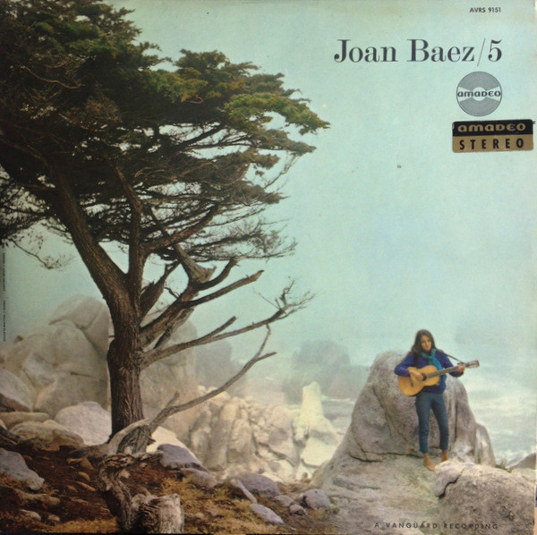
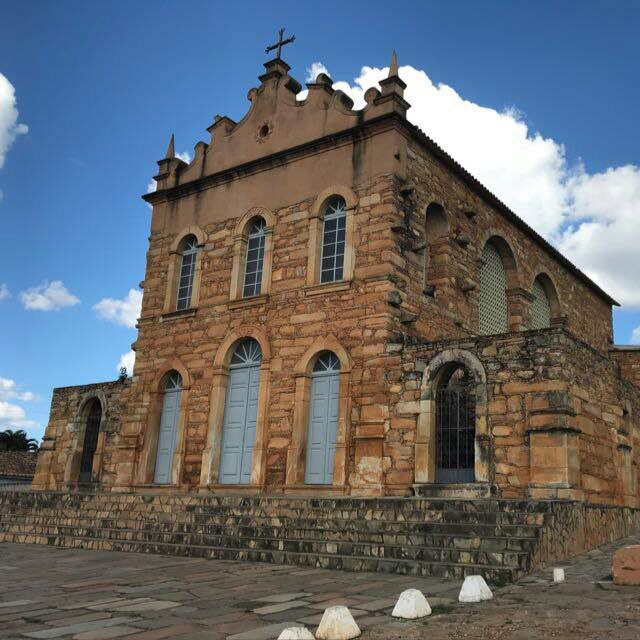
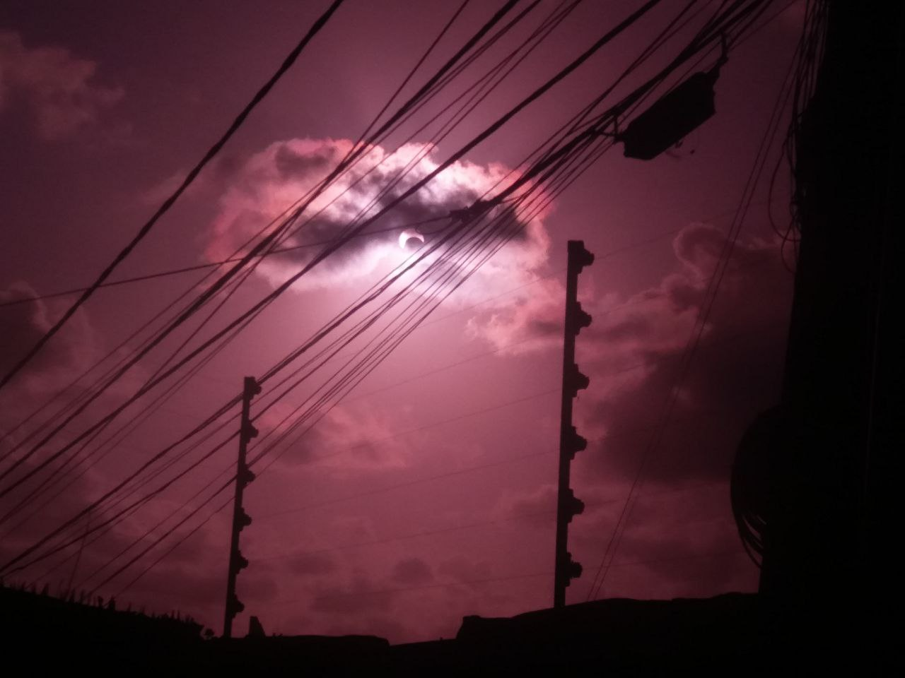

== pontilhismo.cpp

=== Sobre as imagens base

Para esta tarefa, teremos múltiplas imagens base. A primeira é a capa do álbum 5 de Joan Baez, que foi o primeiro álbum
que apareceu na minha biblioteca do Youtube Music com uma fotografia que parecia legal de se fazer pontilhismo.

Para experimentar em imagens com detalhes diferentes, também fiz testes com uma foto da Igreja de Pedra, da cidade de
Rio de Contas (Bahia), de não-sei-quantos-mas-muitos anos atrás; e uma foto do céu sobre a lente de um óculos escuros
rosê durante o eclipse solar em 14 de Outubro de 2023.

=== pontilhismo.cpp

Começando pelo fundo da imagem:

No código original a imagem é dividida em uma grade regular e para cada célula é selecionado um ponto aleatório para
formar o seu ponto. Quando tivéssemos imagens cujas dimensões não fossem múltiplos inteiros do tamanho da grade,
entretanto, perderíamos esse resto da divisão na borda direita e esquerda. Como eu queria experimentar com múltiplos
tamanhos de célula, isso seria bem desagradável, então a imagem pontilhada é feita sendo maior ou igual a imagem
pontilhada e a amostragem das células incompletas faz wrap-around pras suas células com cores (sendo então recortada de
volta ao tamanho original). Como esses artefatos seriam sempre nas bordas direita e inferior, a imagem é espelhada
aleatoriamente antes da transformação.

Outra ideia que tive era de aumentar a variância das imagens. Para isso, a ideia principal foi gerar tamanhos aleatórios
de raio dos pontos, onde amostro de uma distribuição gaussiana (ao invés da uniforme para poder permitir outliers
enquanto garanto que a maioria dentro dos desv.pad.) parametrizável pela linha de comando.

++++
Aqui poderia ser uma imagem só dos pontos, mas bobeei e escrevi tudo num arquivo só e estou com preguiça de colocar um
imwrite pra pegar o valor intermediário

++++

Seguindo para o detalhamento com as bordas:

Para as bordas, parti da ideia de combinar os filtros de canny com valores diferentes. Por estar um pouco folgado no
momento, não procurei no material sobre a parametrização dos valores de threshold do filtro, então fui fazendo testes
com a imagem do exercício 9 até obter um valor interessante. Eventualmente cheguei a algo próximo de 25~50 e pensei em
escalar linearmente (porque é mais fácil) os parâmetros do filtro, com a forma T_start(k) = 25(k+1) e T_high(k)=25(k+2)
sendo alcançada em tentativa e erro.

Com os parâmetros do filtro definidos, continuei na ideia de aumentar a variância reutilizando a ideia da grade: divido
a imagem numa grade regular e amostro de cada célula um ponto com borda aleatório (contanto que haja ponto assim na
célula), que também tem seu raio gerado aleatoriamente (com parâmetros menores). Seguindo a escala linear, conforme se
aumentava o valor dos limiares, diminuíam-se o tamanho dos raios e das células. O primeiro resultado, mostrado abaixo,
foi com valores obtidos por ajuste-fino.

image::baez_pontos.jpg[height=20%, align=center]

Desses valores obtidos em ajuste fino, tentei montar uma relação entre os parâmetros da imagem de fundo (tamanho da
célula, parâmetros da dist. do raio) e o número de filtros de canny — sem isso, os detalhes capturados pelo filtro, como
no de cima, são muitos. Usando os valores hardcoded (agora comentados no código) e uma gaussiana de média e desvio
padrão 0 pros pontos do fundo, podemos ver o impacto:

image::baez_detalhes.png[height=20%, align=center]

De bônus, com isso podemos variar tanto a granularidade do fundo quanto dos detalhes pelos parâmetros, como nessas 
animações para um tamanho de célula 30x30 pixels com raios variando de 1 a 30 (igreja) e tamanho de célula 10x10 com
raios variando de 1 a 10 (eclipse):

image::igreja.gif[height=20%, align=center]

image::eclipse.gif[height=20%, align=center]

Uma ideia possível seria de usar isso para redução de palheta de cores, usando o canny da imagem original enquanto a
imagem de onde as cores são extraídas já estão reduzidas/você aplica a redução no ponto amostrado/você junta os pontos
amostrados antes e aplica a redução de palheta neles antes de pintar.

OBS.: Todos os frames das animações usam a mesma seed, então a disposição dos pontos se mantém e o tamanho (média e os
desvios) escalam, o que (julgo, junto de truncation errors) estar fazendo alguns pontos diminuírem entre frames.

O script para montagem da pasta de frames está disponível (não pus pra usar o imagemagick pra converter pra gif junto
por conta desse imagemagick 7)

=== Íntegra dos códigos

.pontilhismo.cpp
[%collapsible]
====
[source,c++, linenums]
----
include::pontilhismo.cpp[]
----
====

.make_growing_radius_frames.sh
[%collapsible]
====
[source,shell, linenums]
----
include::make_growing_radius_frames.sh[]
----
====