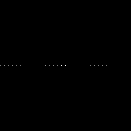
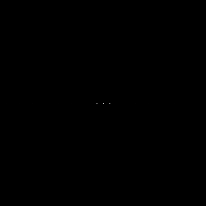
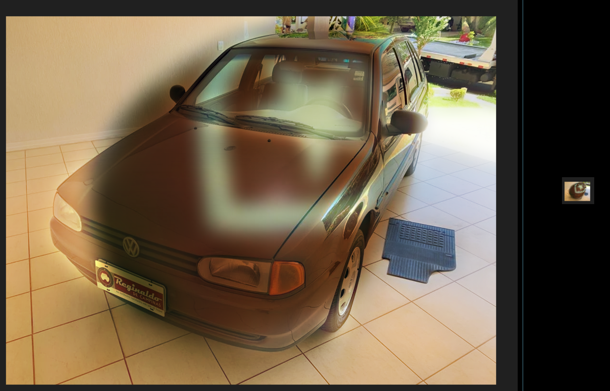

== dft.cpp
:stem: latexmath

Este exercício não encaixou tão bem no formato em que faço essas respostas, já que normalmente comento o que fiz de
mudança no código base para ter o resultado. Aqui é mais teoria e cálculo mesmo, só fiz adicionar no código para poder
ler YAML.

=== Resolução

O espectro de magnitude do sinal em frequência da imagem ficou como abaixo.

É possível observar vários pontos centralizados verticalmente no meio da figura, representando frequências puramente
horizontais (isto é, componentes verticais da frequência nulos). Os valores de destaque são os três mais próximos ao
centro da imagem, representado tanto a frequência do seno quanto um artefato descrito abaixo.

Na teoria, podemos avaliar a transformada da própria função que gerou a imagem. No exercício do FileStorage, vimos que
a função usada para gerar essas imagens é latexmath:[g(x, y) = 127*\sin{2 \pi \frac{P}{M} x} + 128], com P sendo o
número de períodos contidos na imagem (contando no dedo a imagem que transformamos tinha 8 períodos). Como a transformada bidimensional de Fourier discreta é linear, podemos aplicá-la em isoladamente no termo senoidal:

[stem]
++++
\begin{align}
F(u,v) &= \frac{1}{MN}\sum_0^{M-1}\sum_0^{N-1}{127\sin{(\frac{2 \pi u_0}{M} x)}e^{-j 2\pi (\frac{u}{M}x + \frac{v}{N}y)}} \\

&= \frac{1}{M}\sum_0^{M-1}g(x)(\frac{1}{N}\sum_0^{N-1}1e^{-j\frac{2 \pi v}{N}y}) \\
&= \frac{\delta(v)}{M}\sum_0^{M-1}g(x) = \frac{\delta(v)}{M} \sum_0^{N-1}{127\sin{(\frac{2 \pi u_0}{M} x)}e^{-j 2\pi (\frac{u}{M}x)}} \\

&= \frac{127\delta(v)j}{2}(\delta(u + u_0) - \delta(u - u_0)) \\
&= \frac{127}{2}j(\delta(u + u_0, v) - \delta(u - u_0, v))

\end{align}
++++

E então somá-la junto à transformada de latexmath:[g_1(x,y): 128], que é latexmath:[128 \delta(u,v)], obtendo uma magnitude expressa por latexmath:[|G(u,v)| = 128\delta(u,v) + \frac{127}{2}(\delta(u + u_0) + \delta(u - u_0))]. Daí já temos uma diferença: o FFTW NÃO aplica a normalização pelas dimensões da imagem (a divisão por latexmath:[MN]), e isso impacta negativamente na normalização por log da imagem (um pixel que teria 1 na transformada inversa analítica acaba tendo 65536, e o acréscimo de 1 a todos os valores o deixaria em 65537 enquanto que os zeros ficariam 1).

A outra diferença, mais impactante, é causada pela discretização do seno na imagem original. Esses erros de arrendondamento se confundem como componentes senoidais em outras frequências, resultando nos demais pontos no eixo horizontal. Se usássemos a imagem serializada em YAML com ponto flutuante, como fizemos no exercício 2, podemos diminuir esse erro (se você ainda decidir resserealizar para YAML ou só colocar para escrever os valores dos pontos, verá que o erro foi nulo nesse caso), obtendo a seguinte imagem:

=== Extras

- O cálculo do seno foi feito com uma ajuda de uma tabela de propriedades e de transformadas de fourier para frequência linear (não confundir com aquelas que já usam omega direto ao invés de 2 pi f);

- Antes de fazer o cálculo da transformada do seno eu estava procurando em materiais de PDI por algum jeito bom de explicar o cálculo, e acabei encontrando o assunto de imagens híbridas, ilusões feitas através da mesclagem das componentes de alta frequência de uma imagem com as componentes de baixa frequência de outra imagem (a fase em específico, que é quem guarda informação dos formatos). Acho que pode ter espaço pra uma tarefa com elas aqui, ainda mais sendo algo que dá para "brincar". Segue abaixo um teste usando o gerador disponível em https://charliecm.github.io/hybrid-image/ pra fazer uma imagem híbrida de um Gol bola marrom e um ovo de páscoa do Botafogo (que foram pré-processados no gimp antes pra facilitar a geração)

=== Íntegra dos códigos

.dft.cpp
[%collapsible]
====
[source,c++, linenums]
----
include::dft.cpp[]
----
====