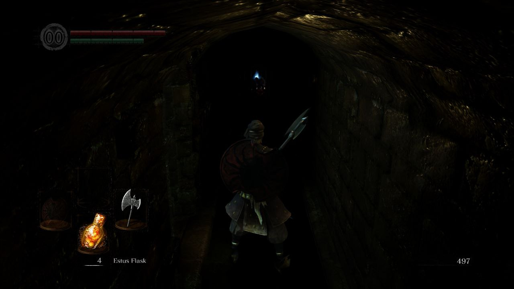

== dftfilter.cpp

=== Sobre a imagem base

A imagem base é uma captura de tela do jogo Dark Souls. Pouco depois do resto do pessoal entrar na UF, transformei meu
notebook antigo num computador da casa, fazendo o favor sacana de deixar o sistema em inglês e com ferramentas livres 
("precisa do photoshop? já tem o gimp", "word? libreoffice writer").

De algum jeito, o pessoal tomou gosto por videogames *assistindo* outras pessoas jogarem na internet, e a ideia de
perder tempo assistindo alguém jogar ao invés de perder tempo jogando me incomodou tanto que também adicionei a
biblioteca de jogos que eu tinha para esse computador, instalei Dark Souls e pus o pessoal para jogar. Na configuração
inicial do jogo, escolheram um brilho absurdamente baixo (que apesar dos meus questionamentos e da perceptível
dificuldade em navegar em corredores escuros, está "de boa") e um momento no tutorial me fez pensar que seria um caso
interessante pro filtro. Essa captura de tela é pouco depois da conclusão do tutorial, em outro mapa, porque já saíram
de lá e eu não quero entregar a eles como que revisita o mapa.

=== dftfilter.cpp

Para o filtro homomórfico usei o Butterworth passa-alta que o González menciona como mais controlável. Adicionei
argumentos para configurar o filtro (ganho mínimo, ganho máximo, frequência de corte e ordem do filtro) e, o mais
importante, adaptei para imagens coloridas.

A adaptação foi feita convertendo a imagem lida em RGB (BGR no caso) para HSV (testei com HSL e achei que perdia muito
detalhe) e aplicando o filtro homomórfico somente no canal V, convertendo o resultado de volta em RGB para
visualização/serialização. São mostradas ainda janelas com o canal V isolado pré e pós filtragem, bem como o filtro em
si, para visualização.

Os parâmetros usados para a imagem abaixo definem os parâmetros padrão do filtro: mínimo 0.0; máximo 1.0; corte 4
(absoluto); e ordem 2.

Pela imagem podemos observar a parede direita indo mais fundo no corredor, junto com mais detalhes do escudo e do bicho
encarando o jogador de longe, <seção redatada para a aba abaixo, consegue discernir algum detalhe do bicho? Tente e
então continue a leitura>

[%collapsible]
====
(...) que talvez permita a distinção de um focinho ou boca ("talvez" porque me julgo enviesado a
isso, apesar da própria indicação do também poder afetar sua percepção).
====

=== Íntegra dos códigos

.dftfilter.cpp
[%collapsible]
====
[source,c++, linenums]
----
include::dftfilter.cpp[]
----
====